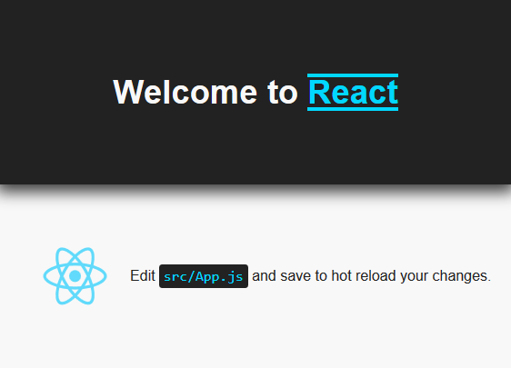
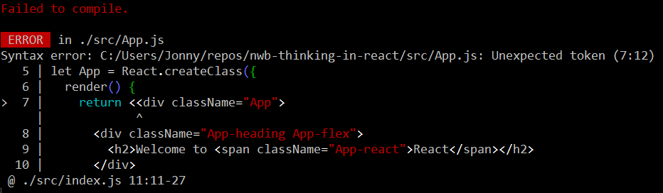
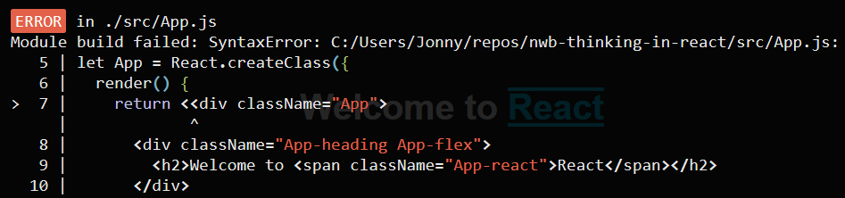
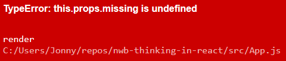
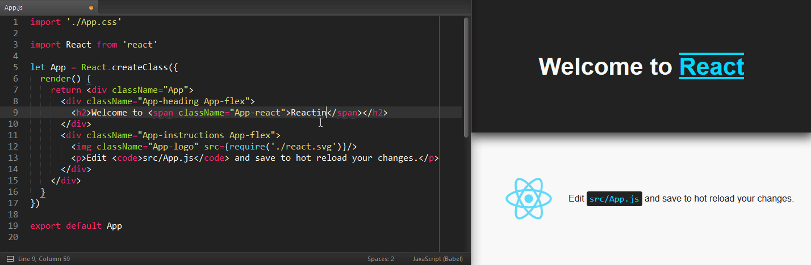
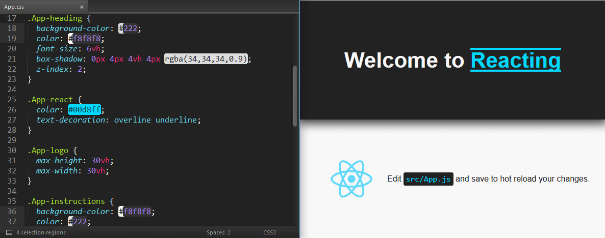
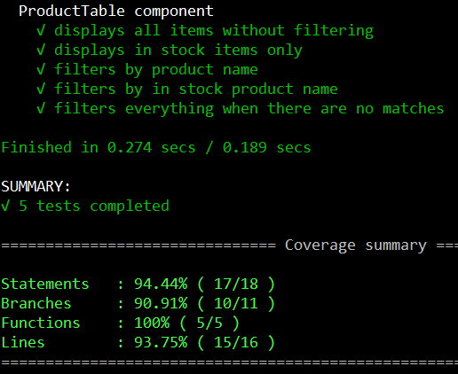
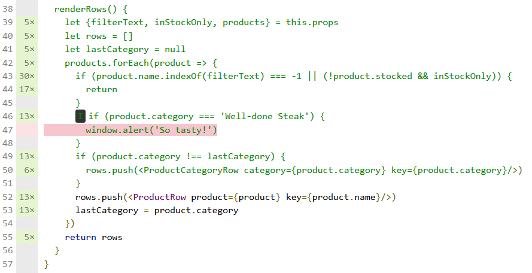
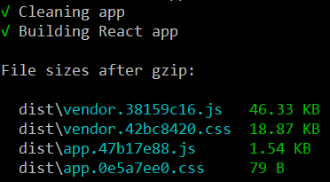
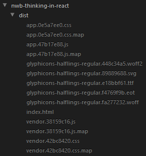

# Developing React Apps with nwb

nwb supports development of production-ready React apps.

> **Prerequisite:** nwb must be installed globally (we're using version 0.12 in this guide):
>
> ```
> npm install -g nwb
> ```

- [Creating a New Project](#creating-a-new-project)
- [Project Layout](#project-layout)
- [`npm run` Scripts](#npm-run-scripts)
- [Running the Development Server](#running-the-development-server)
- [Zero Configuration Development Setup](#zero-configuration-development-setup)
- [Thinking in React Components](#thinking-in-react-components)
  - [Palatable ES6 Class Components](#palatable-es6-class-components)
  - [Stateless Function Components](#stateless-function-components)
- [Entry Point](#entry-point)
- [Testing](#testing)
  - [Code Coverage Reporting](#code-coverage-reporting)
- [Building for Production](#building-for-production)
- [Using nwb in Your Own Express Server via Middleware](#using-nwb-in-your-own-express-server-via-middleware)
- [Appendix: Configuration](#appendix-configuration)
  - [Development Server Feature Flags](#development-server-feature-flags)
    - [Fallback for HTML5 History](#fallback-for-html5-history)
    - [Auto Reload](#auto-reload)
    - [Automatically Install Missing Dependencies](#automatically-install-missing-dependencies)

To walk you though the process, we're going to take the components from [the Thinking in React example](https://facebook.github.io/react/docs/thinking-in-react.html), split them out into individual modules, change some of their implementations to ES6 classes, perform some basic testing and create a production build, all using features nwb provides without any configuration.

> This is a *how to use nwb* guide, not a *how to write React apps* guide; if you're new to React, you might want to walk through Thinking in React first, as it's one of the best ways to get a hands-on feel for developing React components and their data flow.

## Creating a New Project

Use the `nwb new` command to create a new React app project:

```
nwb new react-app nwb-thinking-in-react
```

## Project Layout

The following directory structure will be created:

```
nwb-thinking-in-react/
  .gitignore
  .travis.yml
  CONTRIBUTING.md
  nwb.config.js
  package.json
  README.md
  node_modules/
  public/
    .gitkeep
  src/
    App.css
    App.js
    index.css
    index.html
    index.js
    react.svg
  tests/
    .eslintrc
    App-test.js
```

**dist/**: When you run a build, output will be generated in the `dist/` directory, ready for deployments.

**node_modules/**: Contains modules installed with npm. npm is the standard way to manage front-end, back-end and development dependencies for React projects. `react` and `react-dom` dependencies will be installed from npm into `node_modules/` as part of project creation.

**nwb.config.js**: This file can be used to tweak or extend the default configuration nwb creates for React apps. It can be safely deleted if you don't need configuration.

**public/**: Directory for static assets (such as favicon and app icon files) which will be served by the development server and copied to `dist/` when building.

**src/**: Contains your React app's source. Stylesheets and images used in your application will normally also live here and be directly imported from JavaScript and CSS to be managed by Webpack.

Includes a template for your project's HTML entry point, which will have `<link>` and `<script>` tags for built resources injected when building.

`index.js` and `index.html` are the only files nwb assumes will exist as the entry points for the app. How you write and organise the rest of your app's code is up to you.

> The initial app in `src/` is intended to show some of the things Webpack allows you to do which might be surprising if you've not encountered it before.

> Gist: any file Webpack is configured to deal with (including stylesheets and images) can be imported as if it were a module; Webpack starts from your app's entry module and walks imports to build up a graph of modules to be built.

**tests/**: nwb will find and run tests in a separate `tests/` directory or co-located with your source code under `src/`, as long as their filenames end with `.test.js`, `-test.js` or `.spec.js` - an example of a basic React component test is provided.

---

 `cd` into the project directory and we can get started on our example app:

```sh
cd nwb-thinking-in-react/
```

## `npm run` Scripts

`package.json` is configured with `"scripts"` we can use with `npm run` while developing the project.

Command | Description |
--- | ---
`npm start` | start the app's development server
`npm test` | run tests
`npm run test:coverage` | run tests and produce a code coverage report in `coverage/`
`npm run test:watch` | start a test server and re-run tests on every change
`npm run build` | create a production build in `dist/`
`npm run clean` | delete built resources

The initial project is set up so you can successfully run each of these commands and get some meaningful output.

## Running the Development Server

Running `npm start` will start the development server.

Every time you make a change to the app, it will refresh the current compilation status:

Console | Browser
:---: | :---:
 | 

If there are any errors, they will be displayed in both the console and the browser, so you're unlikely to miss them while developing:

Console Error | Browser Error
:---: | :---:
 | 

If there's an error in the `render()` method of a React component, it will be displayed as a Red Box Of Death overlay in the browser:



A React-specific Hot Module Replacement handler is enabled and will attempt to patch changes into your React components while maintaining their current state:



Changes to stylesheets will also be hot-reloaded into the running app:



The development server will also serve the app's HTML entry file at non-root URLs, for use when developing apps which use the [History API](https://developer.mozilla.org/en-US/docs/Web/API/History_API) (e.g. with [React Router](https://github.com/reactjs/react-router)).

## Zero Configuration Development Setup

nwb generates a comprehensive default configuration for creating React apps using Babel and Webpack.

Without any configuration, the main features you get are:

- Write JavaScript with ES6/ES2015 and JSX transpiled down to ES5.
- Use new JavaScript features which are at Stage 2 and above in the TC39 process:
  - `async`/`await` syntax, for writing async code in a synchronous way.
  - Class properties, for avoiding boilerplate when writing ES6 classes.
  - Decorators.
  - Object rest/spread, for shallow cloning, merging and partially destructuring objects as syntax.
- Polyfills for  `Promise`,  `fetch` and `Object.assign`.
- Import stylesheets (and font resources), images and JSON into JavaScript, to be handled by Webpack.
- Autoprefixed CSS, so you don't need to write browser prefixes.

> The default JavaScript features allow you to write React components in any of the styles you'll see in the React documentation.

## Thinking in React Components

We'll start by splitting each of the main components from [the final Thinking in React example code](https://facebook.github.io/react/docs/thinking-in-react.html#step-5-add-inverse-data-flow) into its own module, which is more representative of how a larger React project will be laid out.

> A single module is perfectly fine for small apps, demos and examples!

- [`FilterableProductTable.js`](https://github.com/insin/nwb-thinking-in-react/blob/master/src/FilterableProductTable.js) holds filter state and composes the other components.
- [`SearchBar.js`](https://github.com/insin/nwb-thinking-in-react/blob/master/src/SearchBar.js) renders a `<form>` with the current filter state and passes changes back up to `FilterableProductTable`.
- [`ProductTable.js`](https://github.com/insin/nwb-thinking-in-react/blob/master/src/ProductTable.js) renders a `<table>` of products filtered according to the current filter state. This module also includes subcomponents used to implement the `ProductTable` component.

### Palatable ES6 Class Components

Thinking in React uses [`React.createClass()`](https://facebook.github.io/react/docs/top-level-api.html#react.createclass) to define its components.

This is arguably the least confusing way to start learning about React components as it auto-binds component methods to the component instance. This means you never have to worry about the value of `this` when using a component method as an event handler or other callback; it just works like you think it should.

For the sake of showing different ways to define components which are enabled by nwb's default configuration, the modules linked to above use [ES6 class components](https://facebook.github.io/react/docs/reusable-components.html#es6-classes) and [stateless function components](https://facebook.github.io/react/docs/reusable-components.html#stateless-functions).

For example, this is part of the `FilterableProductTable` component using `React.createClass()`:

```js
const FilterableProductTable = React.createClass({
  getInitialState: function() {
    return {
      filterText: '',
      inStockOnly: false,
    }
  },

  handleUserInput(filterText, inStockOnly) {
    this.setState({filterText, inStockOnly})
  },

  render() {
    // ...same in all implementations
  }
})
```
Written as a vanilla ES6 class, we would need to perform a `super()` call before we can set anything on `this`, and we'd need to [manually bind](https://facebook.github.io/react/docs/reusable-components.html#no-autobinding) the event handling method:

```js
class FilterableProductTable extends Component {
  constructor(props) {
    super(props)
    this.state = {
      filterText: '',
      inStockOnly: false,
    }
    this.handleUserInput = this.handleUserInput.bind(this)
  }

  handleUserInput(filterText, inStockOnly) {
    this.setState({filterText, inStockOnly})
  }

  render() {
    // ...same in all implementations
  }
}
```

Using experimental class property syntax avoids this constructor boilerplate - the `=` assignment statements in the class body are actually *moved into a generated constructor*, so the event handler arrow function inherits the constructor's `this`, which is roughly equivalent to what `React.createClass()` auto-binding was doing for us:

```js
class FilterableProductTable extends Component {
  state = {
    filterText: '',
    inStockOnly: false,
  }

  handleUserInput = (filterText, inStockOnly) => {
    this.setState({filterText, inStockOnly})
  }

  render() {
    // ...same in all implementations
  }
}
```

> Class properties are *effectively* required to make writing React ES6 class components as palatable as `React.createClass()` components; nwb's default config leaves you free to create components whichever way you prefer.

### Stateless Function Components

This is the `ProductCategoryRow` component using `React.createClass()`:

```js
var ProductCategoryRow = React.createClass({
  render() {
    return <tr><th colSpan="2">{this.props.category}</th></tr>
  }
})
```

And as a [stateless function component](https://facebook.github.io/react/docs/reusable-components.html#stateless-functions):

```js
let ProductCategoryRow = ({category}) => <tr>
  <th colSpan="2">{category}</th>
</tr>
```

> Stateless function components are a  more convenient way to create React components which just manage a particular chunk of rendering based on given props.

## Entry Point

`src/index.js` is the entry point for the React app, which is usually responsible for "global" work prior to rendering the app:

- Importing CSS which will apply globally.
- Performing any required polyfilling.
- Performing configuration of libraries being used which need it, e.g. localisation settings.
- Composing and rendering the app's top-level components.

To spruce up the app's display a bit, we will install [Bootstrap](http://getbootstrap.com/), import it in `index.js` and apply styles to a few of our components:

```
npm install --save bootstrap
```
```js
import 'bootstrap/dist/css/bootstrap.css'
import './index.css'

import React from 'react'
import {render} from 'react-dom'

import FilterableProductTable from './FilterableProductTable'

let products = [
  {category: 'Sporting Goods', price: '$49.99', 'stocked': true, name: 'Football'},
  {category: 'Sporting Goods', price: '$9.99', 'stocked': true, name: 'Baseball'},
  {category: 'Sporting Goods', price: '$29.99', 'stocked': false, name: 'Basketball'},
  {category: 'Electronics', price: '$99.99', 'stocked': true, name: 'iPod Touch'},
  {category: 'Electronics', price: '$399.99', 'stocked': false, name: 'iPhone 5'},
  {category: 'Electronics', price: '$199.99', 'stocked': true, name: 'Nexus 7'},
]

render(
  <FilterableProductTable products={products}/>,
  document.querySelector('#app')
)
```

You can [view the live version of the app here](http://insin.github.io/nwb-thinking-in-react/).

## Testing

nwb provides a default testing setup which uses Karma to run tests written with Mocha and Expect in the headless PhantomJS browser.

> The [Testing documentation](/docs/Testing.md) provides an in-depth overview of what nwb's default testing setup provides (and how to configure things to your liking if you want to), but we'll stick to the defaults and repurpose the initial test in the `tests/` directory to test the `ProductTable` component.

`npm run test:watch` automatically re-runs tests on every change to provide a quick feedback loop while developing, whether you're writing tests up-front, in parallel with implementation or after the fact.

If you're into Test Driven Development, it will give you the flow you want as you write breaking tests followed by implementations which satisfy them.

Here's an example of one of the tests written for the `ProductTable` component, which renders it into the DOM and asserts that names of the appropriate categories and products are present:

```js
// expect isn't in the project's package.json - nwb provides this dependency so
// it can ship with working test examples.
import expect from 'expect'
import React from 'react'
import {render, unmountComponentAtNode} from 'react-dom'

// nwb sets up a `src` alias by default so you can use directory-independent
// imports in non-colocated tests.
import ProductTable from 'src/ProductTable'

let productsFixture = [
  {category: 'Sportsball', price: '$19.99', stocked: true, name: 'Football'},
  {category: 'Sportsball', price: '$29.99', stocked: true, name: 'Baseball'},
  {category: 'Sportsball', price: '$39.99', stocked: false, name: 'Basketball'},
  {category: 'Electronics', price: '$99.99', stocked: true, name: 'iPod Touch'},
  {category: 'Electronics', price: '$199.99', stocked: false, name: 'iPhone 5'},
  {category: 'Electronics', price: '$299.99', stocked: true, name: 'Nexus 7'},
]

describe('ProductTable component', () => {
  let node
  beforeEach(() => { node = document.createElement('div') })
  afterEach(() => { unmountComponentAtNode(node) })

  it('filters by product name', () => {
    render(<ProductTable
      filterText="Bas"
      inStockOnly={false}
      products={productsFixture}
    />, node)
    expect(node.textContent)
      .toContain('Sportsball')
        .toNotContain('Football')
        .toContain('Baseball')
        .toContain('Basketball')
      .toNotContain('Electronics')
        .toNotContain('iPod Touch')
        .toNotContain('iPhone 5')
        .toNotContain('Nexus 7')
  })
})
```

### Code Coverage Reporting

Once your tests are working, you can generate a code coverage report by running `npm run test:coverage`:



Code coverage percentages on their own are fairly meaningless, but running coverage also produces an HTML report in `coverage/html/` showing coverage statistics for each file and annotating your code to show which pieces were and weren't touched during a test run.



This HTML report is handy for finding out what your tests *aren't* covering, and deciding which uncovered areas you'd feel more comfortable having some tests for.

### Continuous Integration (CI) Testing

If you use [GitHub](https://github.com/) for your project's source code hosting, the project is pre-configured for running tests on [Travis CI](https://travis-ci.org/) and posting code coverage results to [coveralls](https://coveralls.io/) and [codecov.io](https://codecov.io/) after successful test runs.

Logging into Travis CI and enabling it for your GitHub project will ensure your tests are run against every subsequent commit and will automatically be run against any Pull Requests your repo receives.

## Building for Production

`npm run build` will create a minified production build in `dist/`, showing the gzipped sizes of generated `.js` and `.css` bundles.

Image and font resources imported by your JavaScript and CSS will also be copied to dist/, as well as any static assets from `public/`.

Build Summary | All Build Output
--- | ---
 | 

By default, a separate `vendor` bundle is created for anything required from `node_modules/` with the assumption that you'll be tweaking your app and its styles more often than you will be changing dependencies.

Generated bundles have a deterministic hash in their filename to support long-term caching (as do imported image and font resources). e.g. if you make a small tweak to your app's JavaScript, only the `app.[hash].js` bundle's filename will change.

The following React-specific optimisations are also performed as part of the build:

- If you're using ES6 class components or stateless function components for any of your app's own components, any `propTypes` they define will be stripped from the build, as React doesn't use PropTypes in production.

## Using nwb in Your Own Express Server via Middleware

If you're writing an app which needs a server, you can use nwb's development build in your own Express server using middleware.

```js
var express = require('express')

var app = express()

// Pass the express module to nwb's middleware
app.use(require('nwb/express')(express))

app.listen(3000, function(err) {
  if (err) {
    console.error('error starting server:')
    console.error(err.stack)
    process.exit(1)
  }
  console.log('server listening at http://localhost:3000')
})
```

For a complete example, see [nwb-react-tutorial](https://github.com/insin/nwb-react-tutorial/#nwb-react-tutorial), which uses nwb middleware to provide a development build for the comment box from [the React tutorial](https://facebook.github.io/react/docs/tutorial.html) from the same server it uses to implement the API.

> This is the way I use nwb in my Node.js projects at work, conditionally importing and using nwb's middleware based on `process.env.NODE_ENV`.

## Configuration and Plugins

nwb aims to support a wide range of a React app's needs with its default configuration, but also allows you to tweak and extend its base configuration when that's not enough for your app.

By default, nwb will look for and attempt to import an `nwb.config.js` file in the root of your project.

For common configuration tweaks, nwb attempts to make things more convenient e.g. setting up new aliases and expressions to be replaced in Webpack is done with convenience config rather than requiring knowledge of how Webpack implements these, or how nwb configures them:

```js
module.exports = {
  webpack: {
    aliases: {
      img: 'src/img'
    },
    define: {
      __VERSION__: JSON.stringify(require('./package.json').version)
    }
  }
}
```

[The Configuration documentation](/docs/Configuration.md#configuration) provides a complete reference to configuration supported by nwb.

### CSS Preprocessor Plugins

If you prefer to write stylesheets using a preprocessor, or you want to [use a CSS framework from source](https://medium.com/@jbscript/using-bootstrap-4-from-source-with-react-and-nwb-f26caf395952), installing one the following npm packages and including it in your project's `devDepenencies` will enable support for the corresponding preprocessor:

- `nwb-less` for [Less](http://lesscss.org/) (in `.less` files)
- `nwb-sass` for [Sass](http://sass-lang.com/) (in `.scss` and `.sass` files)
- `nwb-stylus` for [Stylus](http://stylus-lang.com/) (in `.styl` files)

e.g., to enable Sass support:

```
npm install --save-dev nwb-sass
```

### Development Server Feature Flags

You can pass flags when starting the development server to enable additional features.

> To pass flags to `npm run` commands, you need to pass a `--` argument to indicate all additional arguments should be passed to the command itself.

#### Auto Reload

```
npm start -- --reload
```

There are some changes which can't automatically be patched into a running React app by the [experimental implementation nwb is using](https://github.com/gaearon/react-transform-hmr#react-transform-hmr), or which need to be manually hooked up using Webpack's or Module Replacement API if you want to accept them.

Passing a `--reload` flag will auto-reload the page when Webpack Hot Module Replacement gets stuck.

#### Automatically Install Missing Dependencies

```
npm start -- --install
```

Having to stop and restart the development server when you need to install a new dependency can be annoying break of flow during initial development.

Passing an `--install` flag will use [`NpmInstallPlugin`](https://github.com/ericclemmons/npm-install-webpack-plugin#npm-install-webpack-plugin) to detect missing dependencies and install them from npm (and save them to `dependencies` in `package.json`) for you, so you just have to add an `import` statement or `require()` call as if you already had the dependency installed.

There may be edge cases or "gotchas" with this feature, but it's provided as an [opt-in](https://github.com/facebookincubator/create-react-app/pull/212#issuecomment-235346389) improvement to your developer experience.
