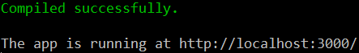

# Creating and Publishing React Components with nwb

> **Prerequisite:** nwb must be installed globally (we're using version 0.12 in this guide):
>
> ```
> npm install -g nwb
> ```

If you have an idea for a reusable React component, or you have an existing component which needs to be published to npm, nwb can take care of the development tooling and configuration for you.

To walk you though the process, we're going to create a simple `LoadingButton` component, which renders a `<button>` and implements the following requirements:

1. The button should take a `loading` prop, representing whichever action it controls being in progress (e.g. loading some data or submitting a form).
2. The button should be `disabled` when loading, to automatically avoid the double-submission problem.
3. The button should default to `type="button"` instead of `<button>`'s usual `type="submit"`, which can be a surprising default.

## Getting Started

Use the `nwb new` command to create a new React component project:

```
nwb new react-component react-loading-button
```

You'll be asked a few questions about your component's build configuration.

> **Note:**
>
> If you want to skip these questions, you can pass an `-f` or `--force` flag to accept the default configuration, or just keep bashing `Enter` to accept the defaults.
>
> If you want to skip *reading* about these questions, continue on to [Project Layout](#project-layout).

nwb will always create an ES5 build for your component in `lib/`, which is the primary way people will use it when installed via npm, and is pointed to by the project's `main` config in `package.json`.

The questions below are about *additional* builds.

```
Creating a react-component project...
? Do you want to create an ES6 modules build? (Y/n)
```

An ES6 modules build retains use of ES6 `import` and `export` statements in your code but transpiles everything else to ES5.

Module bundlers like [Rollup](http://rollupjs.org/) and [Webpack 2](https://webpack.github.io/) can use this build to determine if code was imported but never used and eliminate it from the final bundle.

It's enabled by default, so we can just hit `Enter` to accept the default:

```
? Do you want to create an ES6 modules build? Yes
```

> **Note:** nwb will create an ES6 modules build in `es/` when we build the project later.

```
? Do you want to create a UMD build? (y/N)
```

A UMD build will let people use your component via a global variable by dropping it in a `<script>` tag - this makes it easier to try it without any build tooling, and in tools like [JS Bin](http://jsbin.com/) and [CodePen](https://codepen.io/).

Since nwb will handle the details of creating this for us and [npmcdn](https://npmcdn.com) will allow people to grab the UMD build if we publish it to npm, let's type `y` and hit `Enter`:

```
? Do you want to create a UMD build? Yes
? Which global variable name should the UMD build set?
```

Finally, we need to provide the global variable name for the UMD build to set.

The convention in the React community seems to be a TitleCase version of your component or library's name, so let's go with `ReactLoadingButton`.

```
? Which global variable name should the UMD build set? ReactLoadingButton
```

> **Note:** nwb will create development `react-loading-button.js` and production `react-loading-button.min.js` UMD builds in `umd/` when we build the project later.

## Project Layout

The following directory layout will now be created, with `react` and `react-dom`dependencies installed from npm into `node_modules/` for you:

```
react-loading-button/
  .gitignore
  .travis.yml
  CONTRIBUTING.md
  nwb.config.js
  package.json
  README.md
  demo/
    src/
      index.js
  node_modules/
  src/
    index.js
  tests/
    .eslintrc
    index-test.js
```

If you `cd` into the project directory, you can now use the preconfigured [`npm run` scripts](https://docs.npmjs.com/cli/run-script) while developing the component.

```sh
cd react-loading-button/
```

## `npm run` Scripts

The following `npm run` scripts are configured in the `"scripts"` object in `package.json`:

Command | Description |
--- | ---
`npm start` | start a development server for the demo app
`npm test` | run tests
`npm run test:coverage` | run tests and produce a code coverage report in `coverage/`
`npm run test:watch` | start a test server and re-run tests on every change
`npm run build` | prepare for publishing to npm
`npm run clean` | delete built resources

The initial project is set up so you can sucessfully run these commands and get some meaningful output, albeit for a component which does nothing more than render a welcome message.

## Running the Demo App

The React component project skeleton includes the a demo app in `demo/src/index.js`, which imports and renders the component.

> **Note:** If you don't need the demo app, you can safely delete the `demo/` directory.

Running `npm start` will start a development server for the demo app. Every time you save a change to the demo app or the component, it will display compilation status:



If there are any errors, they will be displayed in the console and the browser:

Console | Browser
:---: | :---:
 | 

Developing components against a live app which uses them gives a README Driven Development feel, as you can play with your component's API before you've built anything, get quick feedback and keep tinkering with the API as you implement.

Let's start by imagining how we'll use our `LoadingButton` component in the demo app:

> **Note:**
>
> This Demo component is implemented as an ES6 class extending React's `Component` class, but also using some [experimental language features](http://babeljs.io/docs/plugins/transform-class-properties/) which are part of Babel's [stage 2 preset](http://babeljs.io/docs/plugins/preset-stage-2/), which is enabled by default when using nwb.
>
> Don't sweat the details of these if you're not familiar with them; the most important thing for this guide is the `render()` method.

```js
import React, {Component} from 'react'
import {render} from 'react-dom'

import LoadingButton from '../../src'

class Demo extends Component {
  state = {loading: false}

  handleToggleLoading = () => {
    this.setState({loading: !this.state.loading})
  }

  render() {
    return <div>
      <h1>react-loading-button Demo</h1>

      <h2>Static</h2>
      <LoadingButton>Load</LoadingButton>
      <LoadingButton loading>Loading</LoadingButton>

      <h2>Dynamic</h2>
      <LoadingButton loading={this.state.loading}>
        {this.state.loading ? 'Loading' : 'Load'}
      </LoadingButton>
      <button type="button" onClick={this.handleToggleLoading}>
        Toggle Loading
      </button>
    </div>
  }
}

render(<Demo/>, document.querySelector('#demo'))
```

Once your component is developed, the demo app falls back to its primary purpose of creating a demo you can deploy without having to build and publish your component separately, as component builds and demo bundles are built from the same source at the same time.

Here's an example implementation of the `LoadingButton` component:

```js
import React, {Component, PropTypes as t} from 'react'

class LoadingButton extends Component {
  static propTypes = {
    disabled: t.bool,
    loading: t.bool,
    type: t.string,
  }
  static defaultProps = {
    disabled: false,
    loading: false,
    type: 'button',
  }
  render() {
    let {children, disabled, loading, type, ...props} = this.props
    if (loading) {
      disabled = true
    }
    return <button disabled={disabled} type={type} {...props}>
      {children}
    </button>
  }
}

export default LoadingButton
```

## Testing

nwb provides a default testing setup which uses Karma to run tests written with Mocha and Expect in the headless PhantomJS browser.

The [Testing Guide](/docs/guides/Testing.md) provides a more in-depth overview of what the default setup allows you to do without any configuration (and how to configure things to your liking), but we'll stick to editing the initial test provided in the React component project skeleton, in `tests/index-test.js`.

Running `npm run test:watch` to run tests on every change is the most convenient way to test when developing a component and writing tests for it, no matter which order you're doing them in.

The following tests were implemented after the `LoadingButton` component was written, adding one `it()` block at a time and tweaking each test as needed based on immediate feedback from re-runs (e.g. I wasn't sure how `disabled={true}` would be represented in the resulting HTML).

> **Note:** Testing against static HTML output is a  brittle way to assert what your components are returning from their `render()` methods, but it's quick and easy for demonstration purposes.

```js
import expect from 'expect'
import React from 'react'
import {renderToStaticMarkup as render} from 'react-dom/server'

import LoadingButton from 'src/'

describe('LoadingButton', () => {
  it('renders a button with type="button"', () => {
    expect(render(<LoadingButton>Test</LoadingButton>))
      .toContain('<button type="button">Test</button>')
  })
  it('disables the button when loading=true', () => {
    expect(render(<LoadingButton loading>Test</LoadingButton>))
      .toContain('<button disabled="" type="button">Test</button>')
  })
  it('disables the button when loading=true even if disabled=false', () => {
    expect(render(<LoadingButton disabled={false} loading>Test</LoadingButton>))
      .toContain('<button disabled="" type="button">Test</button>')
  })
  it('passes other props through', () => {
    expect(render(<LoadingButton className="test">Test</LoadingButton>))
      .toContain('<button type="button" class="test">Test</button>')
  })
})
```

Once your tests are working, you can generate a code coverage report by running `npm run test:coverage`:


Runing coverage also produces a report in `coverage/html/` showing coverage statistics for each file and annotating your code to show which pieces were tested:


## Preparing for Publishing

`npm run build` will prepare the component for publishing, creating:

- An ES5 build in `lib/`
- An ES6 modules build in `es6/` (by default)
- UMD development and production builds in `umd/` (if configuration is provided)

It will also create a production build of the demo React app in `demo/dist/`, ready for deployment to wherever you want to host the demo (e.g. GitHub Pages, Surge)


The project's default `.gitignore` is configured to ignore these directories to avoid/prevent checking built resources in to source control, since npm acts as the canonical source for versioned builds and [npmcdn](https://npmcdn.com) makes it easy to provide access to the UMD build by also publishing it to npm (e.g. the latest UMD build for this example project would be available from `https://npmcdn.com/react-loading-button/umd/react-loading-button.js`) if you were to publish it as `react-loading-button`.

## Publishing to npm

`package.json` is preconfigured with a `files` whitelist which will only include `lib/`, `es/` and `umd/` directories in the npm package, in addition to the usual npm metadata like `package.json` and `README.md`.

Once you've built your project, it's ready for publishing to npm using whatever your preferred process for doing that is, with the simplest being manually running `publish`:

```
npm publish
```

## Appendix: Configuration

XXX
